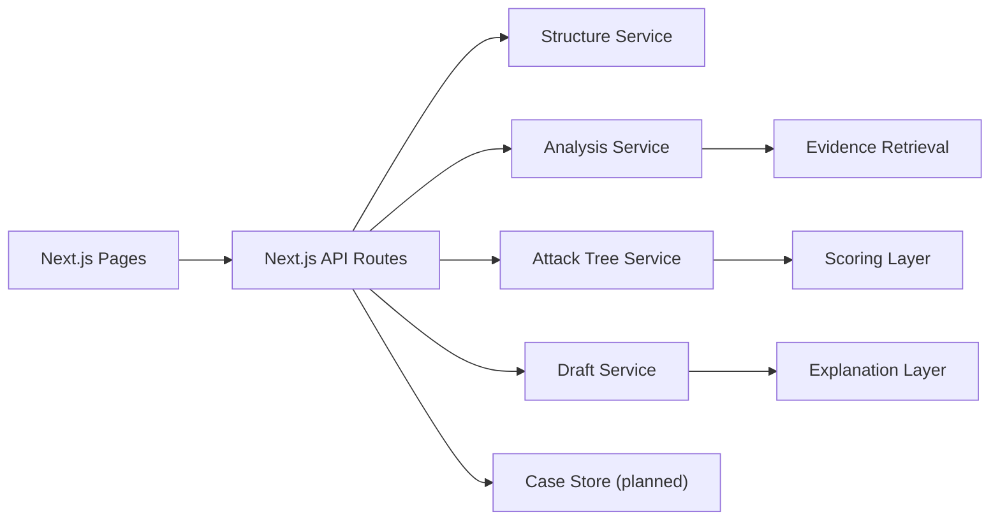

# Backend Documentation Plan

## Purpose

This plan defines the backend documentation needed to support `Advocate` as a real product, not just a frontend demo. It is grounded in the current repository, which already exposes four backend stages:

- `structure`
- `analyze`
- `strategy`
- `draft`

The immediate goal is to document how the website works end to end. The next goal is to document how model outputs, rules, and future neural modules combine into a reliable attack-plan backend.

## Current Backend Shape

The current MVP backend is a single Next.js application with API routes:

- [`/Users/nicol/Desktop/Hackthon/Advocate-remote/app/api/structure/route.ts`](/Users/nicol/Desktop/Hackthon/Advocate-remote/app/api/structure/route.ts)
- [`/Users/nicol/Desktop/Hackthon/Advocate-remote/app/api/analyze/route.ts`](/Users/nicol/Desktop/Hackthon/Advocate-remote/app/api/analyze/route.ts)
- [`/Users/nicol/Desktop/Hackthon/Advocate-remote/app/api/strategy/route.ts`](/Users/nicol/Desktop/Hackthon/Advocate-remote/app/api/strategy/route.ts)
- [`/Users/nicol/Desktop/Hackthon/Advocate-remote/app/api/draft/route.ts`](/Users/nicol/Desktop/Hackthon/Advocate-remote/app/api/draft/route.ts)

Core domain types already exist in:

- [`/Users/nicol/Desktop/Hackthon/Advocate-remote/lib/types.ts`](/Users/nicol/Desktop/Hackthon/Advocate-remote/lib/types.ts)

Prompt contracts already exist in:

- [`/Users/nicol/Desktop/Hackthon/Advocate-remote/lib/prompts.ts`](/Users/nicol/Desktop/Hackthon/Advocate-remote/lib/prompts.ts)

This means the documentation should not describe a greenfield backend. It should describe:

- what exists now
- what must be formalized
- what must be added next

## Backend Functionalities To Document

The backend documentation set should cover these functional areas.

### 1. Website-Level Functionalities

These describe the complete product behavior the backend must support.

- intake of denial letters, EOBs, and medical bills
- document parsing into structured facts
- case analysis for billing errors, deadlines, and appeal grounds
- strategy generation as an attack tree
- document drafting for appeal artifacts
- evidence retrieval and evidence-gap detection
- case state progression across pages
- sample/demo mode fallback
- export/confirmation/status tracking

### 2. Core Backend Services

- `Case Intake Service`
- `Structured Facts Extraction Service`
- `Case Analysis Service`
- `Attack Tree Generation Service`
- `Draft Generation Service`
- `Evidence Retrieval Service`
- `Case Persistence Service` (planned)
- `Scoring / Ranking Service` (planned)
- `Observability / Audit Service` (planned)

### 3. AI / ML Capabilities

- LLM-based extraction
- LLM-based reasoning
- LLM-based drafting
- embedding-based evidence retrieval
- heuristic/rule-based denial classification
- neural or ranking-model-based branch scoring
- future anomaly detection for `Blind Spot`

## Documentation Set To Create

This is the recommended backend doc set.

### P0: Must Have

These should be written first.

1. `System Overview`
- what backend services exist
- what each stage is responsible for
- how the frontend calls the backend

2. `Domain Model`
- structured facts
- analysis result
- attack tree node/edge
- evidence item
- draft document
- case status

3. `API Contracts`
- request/response bodies for all API routes
- validation rules
- error semantics
- sample mode behavior

4. `AI Pipeline`
- stage order
- prompt responsibilities
- deterministic vs model-owned logic
- retry and fallback behavior

5. `Attack Tree Integration`
- how analysis becomes graph nodes
- how evidence and deadlines affect branches
- where confidence comes from
- how branch viability is computed

### P1: Strongly Recommended

6. `Persistence and Case Lifecycle`
- case record schema
- artifact storage
- generated document versions
- status transitions

7. `Evidence Retrieval Architecture`
- embeddings
- chunking
- retrieval sources
- evidence ranking

8. `Scoring and Neural Modules`
- optional neural scorer for branch ranking
- missing-info detection
- anomaly detection

9. `Security and Privacy`
- PHI handling assumptions
- API key handling
- redaction requirements
- logging constraints

10. `Observability`
- request tracing
- stage latency
- model failure rates
- structured logs

### P2: Later

11. `Evaluation Framework`
- extraction accuracy
- attack-tree quality
- drafting quality
- human review criteria

12. `Deployment Architecture`
- local dev
- preview deploys
- production environment split

## Recommended Backend Architecture

For the next phase, keep the backend architecture simple:

- `Next.js API routes` remain the public backend entry point
- extract shared orchestration logic into `/lib/server/*`
- introduce persistence behind a repository layer
- keep external model calls server-side only
- treat attack-tree generation as a first-class backend subsystem, not a UI concern

Recommended near-term service boundaries:

## What Needs To Be Explained In The Docs

### Functional Flow

The docs must explain this end-to-end sequence:

1. User submits a denial letter or bill.
2. Backend extracts `StructuredFacts`.
3. Backend analyzes the case for errors, appeal grounds, and deadlines.
4. Backend constructs an attack tree from those findings.
5. Backend ranks likely next actions.
6. Backend drafts the selected artifact.
7. Backend returns the graph, explanation, and draft to the UI.

### Data Ownership

The docs must make this boundary explicit:

- the `LLM` may extract, summarize, and draft
- the `backend` owns graph structure, branch rules, and action sequencing
- future `neural modules` may score or rank branches, but they do not directly mutate graph schema

That is the right contract if the product is going to remain explainable.

## Documentation Priorities For This Repo

The most valuable docs to write next are:

1. `Backend system overview`
2. `API contracts`
3. `AI and attack-tree integration`
4. `Case persistence and lifecycle`

That order matches the current repo maturity.

## Immediate Implementation Decisions

These should be reflected in the docs.

- Keep the current four-stage pipeline.
- Add a persistent `Case` entity before expanding features.
- Add an explicit `EvidenceItem` type and supporting evidence service.
- Add `Explanation` as its own backend output, not just a freeform string hidden in the graph.
- Make graph layout a frontend concern, but make graph semantics a backend concern.

## Suggested Future Docs Filenames

Recommended next files to add:

- `03-system-overview.md`
- `04-domain-model.md`
- `05-api-contracts.md`
- `06-case-lifecycle.md`
- `07-evidence-retrieval.md`
- `08-security-and-privacy.md`
- `09-observability.md`
- `10-evaluation-plan.md`

## Build Sequence

Backend documentation and implementation should advance in this order:

1. lock the data model
2. lock the API contracts
3. lock AI orchestration boundaries
4. add persistence
5. add retrieval
6. add branch scoring
7. add evaluation and monitoring

If this order is reversed, the system will drift into prompt spaghetti.
