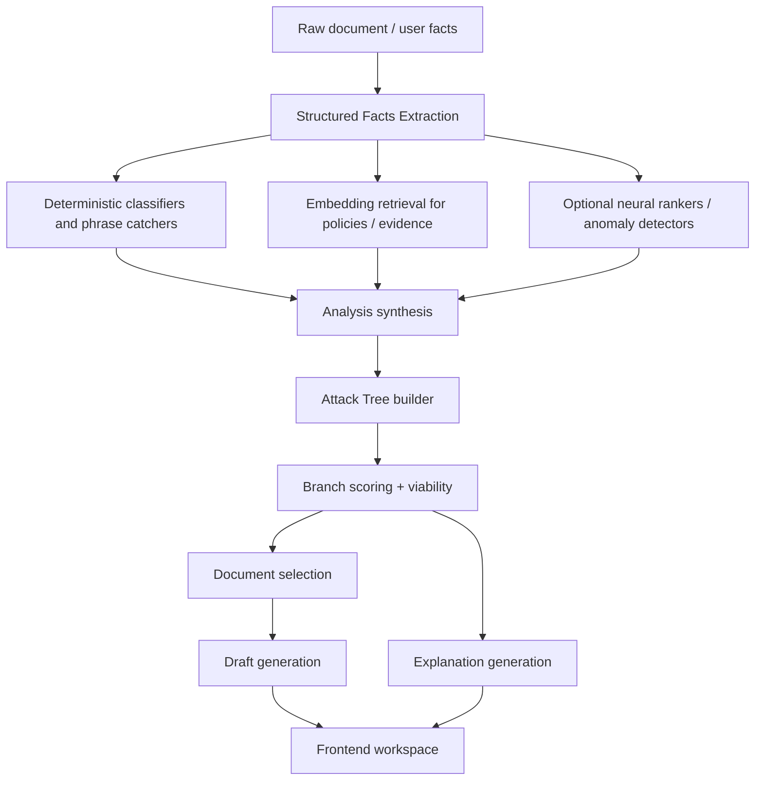

# AI, Neural Networks, and Attack Tree Integration

## Goal

This document defines how `Advocate` should integrate:

- LLM extraction
- heuristic logic
- embedding retrieval
- optional neural network scoring
- attack-plan generation
- attack-tree rendering inputs

The key design rule is:

`models inform the attack tree; the backend owns the attack tree.`

That keeps the system interpretable and debuggable.

## Current Pipeline

The repo already implements this sequence:

1. `structure`
2. `analyze`
3. `strategy`
4. `draft`

Those stages should remain, but the internals should be documented and tightened.

## Proposed Runtime Architecture



## Responsibility By Layer

### 1. Structured Facts Extraction

Input:
- denial letter
- EOB
- bill
- pasted user facts

Output:
- canonical structured case facts

Current type:
- [`StructuredFacts`](/Users/nicol/Desktop/Hackthon/Advocate-remote/lib/types.ts)

This layer is LLM-friendly because:

- the input is messy
- fields are semi-structured
- extraction accuracy benefits from flexible reasoning

This layer should not:

- decide the final appeal path
- decide graph topology

## 2. Deterministic Analysis Layer

This layer should combine:

- phrase catchers
- denial-code mapping
- date parsing
- deadline logic
- CPT/HCPCS heuristics
- regulatory routing rules

This is where the backend should convert fuzzy extracted facts into reliable features.

Examples:

- if denial code matches a prior-auth pattern, add a `coverage_terms` feature
- if emergency care + prior auth denial are both present, add a strong regulatory signal
- if duplicated CPT codes appear on the same service date, add duplicate-billing evidence

This layer should produce:

- normalized analysis features
- evidence candidates
- preliminary action candidates

## 3. Retrieval / Evidence Layer

This layer finds supporting material for the analysis and tree.

Sources:

- plan excerpts
- saved evidence items
- policy references
- prior clinician letters
- canned appeal templates
- future legal/regulatory corpus

Recommended output:

```ts
type EvidenceItem = {
  id: string
  label: string
  sourceType: "user_document" | "policy_excerpt" | "regulation" | "template" | "provider_note"
  snippet: string
  relevanceScore: number
  supportsNodeIds: string[]
  missing: boolean
}
```

This layer should use:

- embeddings for similarity
- deterministic filters for jurisdiction, insurer, and document type

Not everything needs a vector DB on day one. A small local indexed corpus is enough until retrieval scale becomes real.

## 4. Neural / ML Modules

The neural-network layer should be narrow and well-scoped.

Recommended modules:

### A. Branch Viability Ranker

Purpose:
- score candidate branches after the tree is constructed

Input features:
- denial type
- evidence completeness
- deadline proximity
- appeal-ground strength
- prior success heuristics
- document availability

Output:
- viability score `0-1`
- confidence score `0-1`

This can start as:

- a weighted heuristic function

Later it can become:

- a lightweight neural scorer
- a gradient boosting model
- a ranking model trained on adjudicated examples

### B. Missing Information Detector

Purpose:
- predict whether a branch is blocked because the case file is incomplete

Output:
- `requiresMoreInfo: boolean`
- `missingInfoReasons: string[]`

Start with rules.
Upgrade later with a classifier if enough labeled cases exist.

### C. Blind Spot / Anomaly Detector

Purpose:
- detect contradictions, missing clauses, or suspicious gaps across denial text, policy text, and billing records

Examples:

- denial cites prior authorization, but emergency provision overrides it
- bill code disagrees with described service
- plan section cited in denial conflicts with emergency benefits section

This module is the best place for future neural work, because anomaly ranking benefits from pattern recognition beyond simple rules.

## 5. Attack Tree Builder

The attack tree builder should be deterministic.

It should take:

- structured facts
- analysis features
- evidence items
- branch viability scores
- missing-info flags

And produce:

- nodes
- edges
- recommended path
- fallback path
- explanation inputs

The attack tree builder should not ask the LLM to invent arbitrary graph structure in production mode.

Instead, it should use templates like:

- `billing dispute tree`
- `medical necessity appeal tree`
- `external review escalation tree`
- `state complaint branch`

Then fill those templates with case-specific evidence and scores.

## Node Semantics

Recommended node types:

- `action`
- `deadline`
- `document`
- `evidence`
- `escalation`
- `outcome`
- `missing-info`

Recommended node extension:

```ts
type AttackTreeNodeV2 = {
  id: string
  type: "action" | "deadline" | "document" | "evidence" | "escalation" | "outcome" | "missing-info"
  label: string
  description: string
  status: "ready" | "blocked" | "optional"
  urgency: "immediate" | "this_week" | "this_month"
  confidence: number
  viability: number
  evidenceIds: string[]
  missingInfoReasons?: string[]
  documentType?: string
}
```

Recommended edge types:

- `sequence`
- `fallback`
- `parallel`
- `supports`
- `blocks`

## How Models Should Influence The Tree

The correct control flow is:

1. model extracts facts
2. backend normalizes facts
3. backend generates candidate branches
4. model or scorer ranks branches
5. backend selects and serializes final tree

Not:

1. model directly writes the whole tree
2. frontend tries to recover structure later

The second approach is fragile and impossible to evaluate properly.

## Explanation Layer

Every selected branch should be explainable from concrete signals.

Recommended explanation output:

```ts
type Explanation = {
  recommendedNodeId: string
  whySelected: string
  strongestSignals: string[]
  evidenceUsed: string[]
  missingInfo: string[]
  fallbackOptions: string[]
}
```

The explanation should cite:

- extracted facts
- matched evidence
- deadline pressures
- denial-type rules
- viability score inputs

The explanation can be LLM-polished, but it should be assembled from structured data first.

## Production Guidance

### For MVP

Use:

- LLM for extraction
- LLM for summary and drafting
- deterministic graph templates
- deterministic scoring heuristics
- deterministic deadline logic
- optional embeddings for evidence retrieval

This is enough to ship a reliable demo and a credible v1 backend.

### For V2

Add:

- vector-backed evidence retrieval
- explicit case persistence
- branch-ranking model
- anomaly detection for `Blind Spot`
- eval harness for extraction and tree quality

## Evaluation Strategy

The AI/graph system should be tested on four axes:

1. `Extraction quality`
- are facts correct?

2. `Branch quality`
- are recommended next steps sensible?

3. `Evidence grounding`
- does each branch have real support?

4. `Draft usefulness`
- is the generated document actually usable?

The attack tree should fail closed:

- if evidence is weak, mark the branch as blocked
- if deadlines are unclear, surface uncertainty
- if retrieval finds nothing, do not fabricate citations

## Implementation Sequence

1. keep current four endpoints
2. add shared backend orchestration modules
3. add `EvidenceItem` and `Explanation` types
4. move tree generation from prompt-only to template + scoring
5. add retrieval layer
6. add optional neural scorer
7. add anomaly detection as `Blind Spot`

## Final Rule

The backend should treat the attack tree as a decision artifact, not a UI decoration.

That means:

- graph logic belongs in the backend
- graph layout belongs in the frontend
- model outputs are inputs to the tree, not the tree itself
