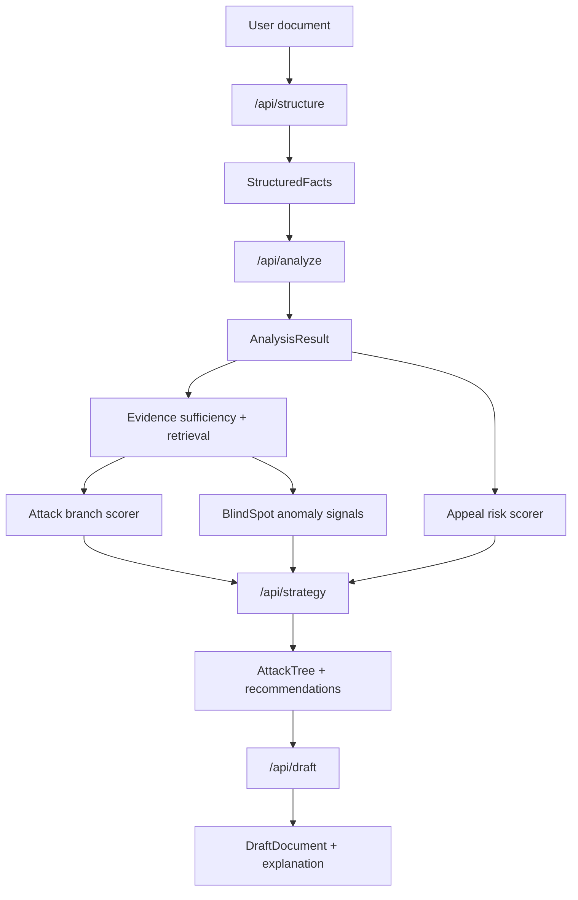

# Model Artifacts and Backend Integration

## Purpose

This document interprets the model artifacts in:

- [`/Users/nicol/Desktop/neural networks and model`](/Users/nicol/Desktop/neural%20networks%20and%20model)

and explains how they should connect to the `Advocate` backend.

This is not a generic ML note. It is based on the actual files provided:

- `attack_branch_model.pt`
- `attack_branch_model.py`
- `attack_branch_data.py`
- `attack_branch_config.py`
- `predict_attack_branch.py`
- `appeal_risk_model.pt`
- `appeal_encoders.pkl`
- `appeal_scaler.pkl`
- `inference.py`
- `Advocate + BlindSpot.pdf`

## Executive Summary

There are really three separate model systems here.

1. `Attack branch viability model`
- a real PyTorch multi-head model
- predicts branch recommendation signals for an attack tree
- currently trained on generic litigation/court-case labels, not medical insurance appeals

2. `Appeal risk model`
- a separate PyTorch MLP that outputs one scalar score
- uses sklearn encoders and a scaler
- appears materially closer to medical-appeal use cases than the branch model
- the exact feature registry is incomplete from the artifacts alone

3. `BlindSpot document classifier`
- not a locally trained neural network in this folder
- a Hugging Face inference wrapper around legal-text models
- designed for clause/conflict detection in legal documents

For the current `Advocate` product, the right backend architecture is:

- keep `Next.js` as the public app/backend shell
- add a small `Python inference service` for model-serving
- use models for `scoring`, `ranking`, and `anomaly signals`
- do not let these models directly own the attack tree structure

## Critical Domain Fit Assessment

This is the most important finding.

### Good News

The artifacts reflect the right *kind* of architecture:

- structured fact extraction
- evidence sufficiency
- branch ranking
- recommendation generation
- document-intelligence sidecar

That maps well to the current `Advocate` backend plan.

### Bad News

The provided artifacts are not all aligned to the current product domain.

#### Attack branch model

The saved vocabularies in `attack_branch_model.pt` are litigation-oriented:

- issue classes like `Contract Dispute`, `Insurance - Bad Faith`, `Tort - Medical Malpractice`
- branch types like `Bench Trial`, `Jury Trial`, `Motion to Dismiss Granted`, `Summary Judgment - Plaintiff`
- jurisdictions like `First Circuit`, `Second Circuit`, `Ninth Circuit`

That means the model is not currently scoring medical-appeal workflow branches such as:

- internal appeal
- external review
- itemized bill request
- coding correction
- regulator complaint

So the model is useful as an architectural prototype, but not as a production-ready scorer for the current health-claims product without retraining or a hard remapping layer.

#### BlindSpot

The `BlindSpot` PDF and `inference.py` are also legal-document-oriented.

The zero-shot labels include:

- termination or cancellation
- liability or indemnification
- confidentiality or non-disclosure
- dispute resolution or arbitration
- governing law or jurisdiction

This is not aligned with insurance denials yet.

#### Appeal risk model

This artifact is the closest to the current product.

The encoders show medical/claims-oriented categorical inputs:

- `insurance_type`
- `claim_type`
- `diagnosis_chapter`
- `denial_reason`
- `provider_type`

This strongly suggests the risk model is intended for health-insurance appeal or claim-risk scoring.

## Artifact-By-Artifact Interpretation

## 1. Attack Branch Model

Source files:

- [`attack_branch_model.py`](/Users/nicol/Desktop/neural%20networks%20and%20model/attack_branch_model.py)
- [`attack_branch_config.py`](/Users/nicol/Desktop/neural%20networks%20and%20model/attack_branch_config.py)
- [`attack_branch_data.py`](/Users/nicol/Desktop/neural%20networks%20and%20model/attack_branch_data.py)
- [`predict_attack_branch.py`](/Users/nicol/Desktop/neural%20networks%20and%20model/predict_attack_branch.py)

### What It Represents

This is a multi-head neural network for branch-level strategy scoring.

Inputs:

- `issue_class`
- `branch_type`
- `evidence_score`
- `case_similarity`
- `jurisdiction`

Outputs:

- `branch_id`
- `viability_score`
- `favorable_outcome_probability`
- `escalation_level`
- `confidence`

### Architecture

The model uses:

- categorical embeddings for `issue_class`, `branch_type`, and `jurisdiction`
- two scalar numerical features: `evidence_score` and `case_similarity`
- a shared MLP backbone
- multiple output heads

Current config from the artifact:

- embedding dim: `16`
- hidden dims: `[64, 64, 32]`
- output heads:
  - branch classification
  - viability regression
  - favorable outcome regression
  - escalation classification
  - confidence regression

### Why It Matters

This is the right conceptual model for branch scoring in the attack tree.

It should eventually score branches like:

- `request itemized bill`
- `file internal appeal`
- `obtain physician letter`
- `correct CPT code`
- `file external review`
- `file regulator complaint`

### Current Problem

The saved training vocabulary is not medical-appeal specific.

So this model can only be used in one of two ways:

1. `prototype scoring only`
- use it as a proof of architecture
- do not present its predictions as real healthcare guidance

2. `retrain for Advocate`
- replace issue classes, branch types, and jurisdiction vocabularies with health-appeal labels

### Backend Role

This model belongs in the backend as a `branch-ranking service`.

It should run after:

- structured fact extraction
- evidence sufficiency scoring
- historical case similarity lookup

It should not run before candidate branches exist.

## 2. Appeal Risk Model

Source artifacts:

- [`appeal_risk_model.pt`](/Users/nicol/Desktop/neural%20networks%20and%20model/appeal_risk_model.pt)
- [`appeal_encoders.pkl`](/Users/nicol/Desktop/neural%20networks%20and%20model/appeal_encoders.pkl)
- [`appeal_scaler.pkl`](/Users/nicol/Desktop/neural%20networks%20and%20model/appeal_scaler.pkl)

### What It Represents

This appears to be a whole-case risk scoring model for insurance or appeal scenarios.

The artifact strongly suggests:

- encoded categorical inputs
- scaled numeric features
- a single scalar output

The likely purpose is one of:

- overall appeal success probability
- denial reversal probability
- case risk score
- escalation likelihood

The exact target label is not recoverable from the artifact alone.

That means the backend must treat the current output as:

- `risk_score`

until the training label is explicitly documented.

### What We Can Confirm

The model depends on five categorical encoders:

- `insurance_type`
  - `Dual Eligible`
  - `Medicaid`
  - `Medicare`
  - `Medicare Advantage`

- `claim_type`
  - `DME`
  - `Inpatient`
  - `Mental Health`
  - `Outpatient`
  - `Professional`

- `diagnosis_chapter`
  - `Circulatory (I)`
  - `Digestive (K)`
  - `Endocrine (E)`
  - `Genitourinary (N)`
  - `Mental Health (F)`
  - `Musculoskeletal (M)`
  - `Neoplasms (C)`
  - `Nervous System (G)`
  - `Other`
  - `Respiratory (J)`

- `denial_reason`
  - `Authorization not obtained`
  - `Coding error / incorrect procedure code`
  - `Duplicate claim`
  - `Medical necessity not established`
  - `Provider not in network`
  - `Service not covered by plan`
  - `Timely filing limit exceeded`

- `provider_type`
  - `DME Supplier`
  - `Home Health`
  - `Hospital`
  - `Physician`
  - `SNF`

The scaler confirms:

- total input feature count: `18`

So this model consumes:

- `5 encoded categorical fields`
- `13 additional numeric features`

### What We Cannot Confirm

These artifacts do not tell us:

- the exact list and order of the 13 numeric features
- the training target definition
- the classification threshold or business threshold
- calibration quality

This is a hard constraint.

Before production use, the backend needs a formal feature registry.

### Likely Architecture

Based on the serialized layer shapes, this looks like a tabular MLP:

- input dim `18`
- hidden layers around `128 -> 64 -> 32`
- final scalar output

That is a sensible architecture for case-level risk scoring.

### Backend Role

This model should be used as a `case-level prior score`, not as the sole decision maker.

Recommended use:

- rank how difficult or risky a denial is
- prioritize which branches need stronger evidence
- adjust urgency and recommendation ordering

Do not use it to:

- generate the tree directly
- override deterministic deadline logic
- replace evidence sufficiency

## 3. BlindSpot Inference Module

Source file:

- [`inference.py`](/Users/nicol/Desktop/neural%20networks%20and%20model/inference.py)

### What It Represents

This is a document-intelligence helper, not a trained local model artifact.

It wraps:

- Hugging Face inference
- Legal-BERT fill-mask
- zero-shot classification for conflict labels

### Current Labels

Its current label space is legal-contract oriented:

- termination
- indemnification
- confidentiality
- arbitration
- payment dispute
- IP ownership
- governing law

### Backend Role

For the current product, this should be repurposed into a `BlindSpot anomaly layer` for denial documents and supporting records.

The right future labels for health-claims workflows would look more like:

- emergency exception conflict
- prior authorization conflict
- medical necessity gap
- coverage terms mismatch
- coding inconsistency
- provider network dispute
- timely filing issue
- missing clinician support

## How These Models Fit The Current Backend

Current backend pipeline in the repo:

1. `POST /api/structure`
2. `POST /api/analyze`
3. `POST /api/strategy`
4. `POST /api/draft`

Recommended upgraded backend flow:



## Concrete Backend Integration Plan

## A. Do Not Serve These Models Directly From Next.js

The current app backend is TypeScript/Next.js.

These artifacts require:

- `PyTorch`
- `scikit-learn`
- `huggingface_hub`

So the clean architecture is:

- `Next.js app` remains the main product server
- add a small `Python FastAPI inference service`
- Next.js API routes call the inference service over HTTP

Recommended service split:

### Next.js owns

- auth/session
- case lifecycle
- user-facing API routes
- request validation
- orchestration
- persistence
- fallback/sample mode

### Python service owns

- model loading
- feature encoding/scaling
- branch scoring inference
- appeal risk scoring inference
- BlindSpot classification inference

## B. Recommended Python Inference Endpoints

Create a service with endpoints like:

### `POST /predict/appeal-risk`

Request:

```json
{
  "insurance_type": "Medicare Advantage",
  "claim_type": "Outpatient",
  "diagnosis_chapter": "Musculoskeletal (M)",
  "denial_reason": "Medical necessity not established",
  "provider_type": "Hospital",
  "numeric_features": {
    "denied_amount": 3400,
    "days_since_notice": 14,
    "days_to_deadline": 166,
    "evidence_count": 3
  }
}
```

Response:

```json
{
  "risk_score": 0.68,
  "model_version": "appeal_risk_model_v1",
  "feature_contract_complete": false,
  "warning": "Numeric feature registry is partially reconstructed and must be finalized before production use."
}
```

### `POST /predict/branch-viability`

Request:

```json
{
  "issue_class": "Insurance - Coverage Dispute",
  "branch_type": "appeal",
  "evidence_score": 0.74,
  "case_similarity": 0.66,
  "jurisdiction": "state_ca"
}
```

Response:

```json
{
  "branch_id": "n3",
  "viability_score": 0.74,
  "favorable_outcome_probability": 0.69,
  "escalation_level": "high",
  "confidence": 0.71
}
```

Important:

For the current saved artifact, these labels do not actually match the health-claims product. So in practice, this endpoint should be treated as:

- prototype-only until retrained

### `POST /analyze/blindspot`

Request:

```json
{
  "text": "Denial cites prior authorization, but the service was performed during an ER encounter."
}
```

Response:

```json
{
  "primary": {
    "label": "emergency exception conflict",
    "score": 0.83
  },
  "secondary": {
    "label": "coverage terms mismatch",
    "score": 0.61
  }
}
```

This requires relabeling from the current contract-law categories.

## C. Where The Scores Plug Into Strategy Generation

Recommended contract for `strategy` stage:

### Inputs to strategy builder

- `AnalysisResult`
- `EvidenceItem[]`
- `appealRiskScore`
- `branchScores[]`
- `blindSpotSignals[]`

### Strategy builder logic

1. Generate candidate branches from deterministic templates.
2. Attach evidence sufficiency to each branch.
3. Score each branch with the branch model or heuristic substitute.
4. Penalize branches with missing evidence.
5. Increase escalation priority when:
   - appeal risk is high
   - deadline pressure is high
   - BlindSpot detects a contradiction favorable to the user
6. Serialize final attack tree.

This keeps the models as scoring components, not graph owners.

## D. Required Backend Data Structures

The backend should add these types.

```ts
type BranchScore = {
  branchTemplateId: string
  branchId: string
  viabilityScore: number
  favorableOutcomeProbability: number
  escalationLevel: "low" | "medium" | "high"
  confidence: number
  source: "neural_model" | "heuristic"
}

type AppealRiskScore = {
  riskScore: number
  source: "appeal_risk_model"
  featureContractComplete: boolean
  warning?: string
}

type BlindSpotSignal = {
  primaryLabel: string
  primaryScore: number
  secondaryLabel?: string
  secondaryScore?: number
  textSpan?: string
}
```

## What Is Reusable Right Now

You can use these parts immediately:

### Reusable now

- the architectural pattern from the PDF
- the branch-scoring model shape
- the appeal-risk encoders
- the idea of evidence score + similarity as branch features
- the BlindSpot sidecar pattern

### Not reusable as-is

- litigation vocabularies for the branch model
- contract-law zero-shot labels in BlindSpot
- any medical-appeal use of the risk model without a documented 18-feature registry

## Recommended Implementation Sequence

### Phase 1

- add Python inference service
- load model artifacts
- expose stubbed endpoints
- return warnings for incomplete contracts

### Phase 2

- integrate appeal risk model as case-level scoring
- use heuristic branch scoring in production path
- use saved branch model only in prototype mode

### Phase 3

- retrain branch model on health-appeal labels
- relabel BlindSpot categories for insurance-denial anomalies
- formalize risk-model feature registry

### Phase 4

- calibrate thresholds
- add evaluation harness
- track model versioning and drift

## Hard Requirements Before Production Use

These artifacts are not production-ready until the backend team has:

1. documented the appeal-risk feature order
2. documented the appeal-risk target label
3. retrained or remapped the branch model to health-appeal branches
4. changed BlindSpot labels away from contract-law categories
5. added model versioning and confidence handling

## Final Recommendation

Use the artifacts as follows:

- `appeal_risk_model`: keep and integrate first, but only after defining the feature contract
- `attack_branch_model`: use as an architectural prototype; retrain before real use in medical-appeal flows
- `BlindSpot`: keep as the future anomaly-detection module, but relabel and reprompt it for denial/policy conflicts

That gives you a backend architecture that is honest, explainable, and compatible with the product you are actually building.
